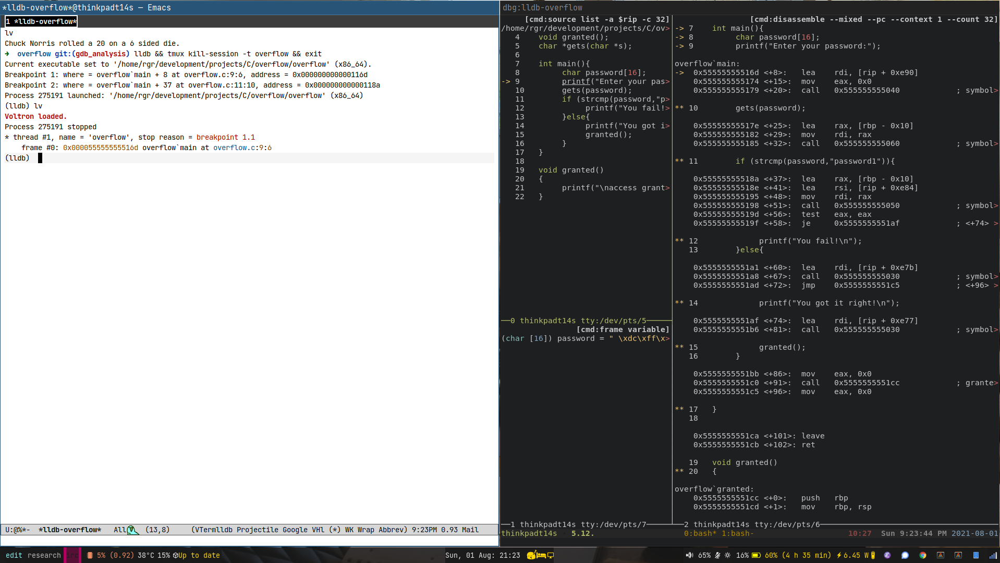

- [emacs-lldb-voltron](#org5c49c95)
  - [Images](#org38a9bfc)
  - [Video](#org0592afc)
  - [lldb-voltron.el](#org8955f08)
    - [customisation](#org785146f)
    - [rgr/lldb-mode](#org70ce9dc)
    - [rgr/lldb-voltron-vterm](#orge6b8235)
    - [provide](#orgd58ae35)
  - [support scripts](#org32cbecc)
    - [voltron support scripts](#orga3b2336)
    - [lldb init and loading voltron](#org211de50)
    - [lldb-ui-session](#org320a719)
    - [lldb-ui](#org36d13e7)


<a id="org5c49c95"></a>

# emacs-lldb-voltron

lldb interface in emacs hosted in a [vterm](https://github.com/akermu/emacs-libvterm). The source/stack etc is displayed using a [tmux](https://github.com/tmux/tmux) session set up to run [voltron](https://github.com/snare/voltron) scripts which get updated dynamically by [lldb](https://lldb.llvm.org/use/map.html). The scripts used are maintained in a sister project located [here](https://github.com/rileyrg/linux-init).


<a id="org38a9bfc"></a>

## Images




<a id="org0592afc"></a>

## Video

A quick video showing a small test project, overflow, its .lldbinit and then launching the lldb interface from the overflow.c file using the keybindings documented [below](#orge6b8235). We hop over to the tmux hosting terminal and swap tmux windows and panes configured [here](#org320a719)

<https://www.youtube.com/watch?v=6-2_pi-FuU8>


<a id="org8955f08"></a>

## lldb-voltron.el

link : [lldb-voltron.el](lldb-voltron.el)

Code to launch a lldb session in a vterm and a terminal with a tmux session holding various voltron snippets which talk to lldb for the debugger output UI.


<a id="org785146f"></a>

### customisation

```emacs-lisp
(defgroup rgr/llvm  nil
  "llvm options"
  :group 'rgr)

(defcustom rgr/lldb-ui-command "lldb-ui"
  "the ui/voltron command"
  :type 'string
  :group 'rgr/llvm)
(defcustom rgr/lldb-voltron-buffer-name "vterm-lldb-voltron"
  "the ui/voltron buffer base name"
  :type 'string
  :group 'rgr/llvm)
```


<a id="org70ce9dc"></a>

### rgr/lldb-mode

minor mode to talk to an llvm console in vterm

```emacs-lisp
(define-minor-mode rgr/lldb-mode "my lldb mode" :lighter "lldb"
  :keymap '(
            ( [f10]   . (lambda()(interactive)(process-send-string (current-buffer) "thread step-over\n")))
            ( [f11]   . (lambda()(interactive)(process-send-string (current-buffer) "thread step-in\n")))
            ( [S-f11] . (lambda()(interactive)(process-send-string (current-buffer) "thread step-out\n")))
            ( [f12]  . (lambda()(interactive)(process-send-string (current-buffer) "thread step-inst\n")))))

```


<a id="orge6b8235"></a>

### rgr/lldb-voltron-vterm

```emacs-lisp
(defun rgr/lldb-voltron-vterm(dir)
  "Run a vterm with lldb for the current buffer's directory, default DIR. Launch a lldb-ui instance unless prefix arg."
  (interactive "DDirectory:")
  (let* ((session-name (file-name-nondirectory(directory-file-name dir)))
         (lldb-ui-command (format "%s %s %s &" rgr/lldb-ui-command dir session-name))
         (vterm-buffer-name (format "*%s:%s*" rgr/lldb-voltron-buffer-name session-name)))
    (if (get-buffer vterm-buffer-name)
        (switch-to-buffer vterm-buffer-name)
      (progn
        (with-current-buffer (vterm)
          (process-send-string (current-buffer) (format "lldb && tmux kill-session -t %s && exit\n" session-name))
          (unless current-prefix-arg
            (call-process-shell-command lldb-ui-command)
            (process-send-string (current-buffer) "lv\n"))
          (rgr/lldb-mode))))))

(use-package projectile
  :bind
  (:map projectile-command-map ("D" . rgr/lldb-voltron-vterm))
  )

```


<a id="orgd58ae35"></a>

### provide

```emacs-lisp
(provide 'lldb-voltron)
```


<a id="org32cbecc"></a>

## support scripts


<a id="orga3b2336"></a>

### voltron support scripts

<https://github.com/rileyrg/linux-init/tree/master/directories/bin/llvm>

-   voltron-source

    ```bash
    #!/usr/bin/env bash
    # Maintained in linux-config.org
    voltron v c 'source list -a $rip -c '"${1:-32}"''
    ```

-   voltron-disassembly

    ```bash
    #!/usr/bin/env bash
    # Maintained in linux-config.org
    voltron v c 'disassemble --pc --context '"${1:-4}"' --count '"${2:-4}"''
    ```

-   voltron-disassembly-mixed

    ```bash
    #!/usr/bin/env bash
    # Maintained in linux-config.org
    voltron v c 'disassemble --mixed --pc --context '"${1:-1}"' --count '"${2:-32}"''
    ```

-   voltron-locals

    ```bash
    #!/usr/bin/env bash
    # Maintained in linux-config.org
    voltron v c 'frame variable' --lexer c
    ```

-   voltron-breakpoints

    ```bash
    #!/usr/bin/env bash
    # Maintained in linux-config.org
    voltron v c 'breakpoint list'
    ```

-   voltron-registers

    ```bash
    #!/usr/bin/env bash
    # Maintained in linux-config.org
    voltron v registers
    ```

-   voltron-backtrace

    ```bash
    #!/usr/bin/env bash
    # Maintained in linux-config.org
    voltron v c 'thread backtrace'
    ```

-   voltron-stack

    ```bash
    #!/usr/bin/env bash
    # Maintained in linux-config.org
    voltron v stack
    ```


<a id="org211de50"></a>

### lldb init and loading voltron

<https://github.com/rileyrg/linux-init/blob/master/DotFiles/.lldbinit>

The important bit is loading voltron support into lldb. This can be done via a [.lldbinit](https://github.com/rileyrg/linux-init/blob/master/DotFiles/.lldbinit) file. At time of writing this init line create an lv alias to load voltron.

```bash
command alias lv command script import "/home/rgr/.local/lib/python3.9/site-packages/voltron/entry.py"
```

This alias is triggered in the [elisp](#orge6b8235) above.

The full [.lldbinit](https://github.com/rileyrg/linux-init/blob/master/DotFiles/.lldbinit) file I use

```config
# Maintained in linux-config.org

#settings write -f .lldb-settings-local-start
#settings read  -f .lldb-settings-local

settings set target.load-cwd-lldbinit true
settings set interpreter.prompt-on-quit false
settings set target.x86-disassembly-flavor intel

command alias bfl breakpoint set -f %1 -l %2
command alias lv command script import "/home/rgr/.local/lib/python3.9/site-packages/voltron/entry.py"
command alias sl source list -a $rip
command alias so thread step-out

command regex srcb 's/([0-9]+)/settings set stop-line-count-before %1/'
srcb 0
command regex srca 's/([0-9]+)/settings set stop-line-count-after %1/'
srca 0

settings set stop-disassembly-display no-debuginfo


break set -p "inspect_"

#alias vtty = shell tmux-pane-tty voltron 4

#define voltron-source-tty
#shell tmux-pane-tty
#end
```


<a id="org320a719"></a>

### lldb-ui-session

[lldb-ui-session](https://github.com/rileyrg/linux-init/blob/master/directories/bin/llvm/lldb-ui-session) creates a tmux session which you later attach to a terminal: It utilises a suite of small [voltron snippets](https://github.com/rileyrg/linux-init/tree/master/directories/bin/llvm).

```emacs-lisp
#!/usr/bin/env bash
# Maintained in linux-config.org

# create a lldb debug session unless it already exists.
# the -d to new session says "dont attach to current terminal"
# there is a bug where the splt panes split that of a tmux session in the terminal
# we issue the command from. No idea why or how.
# directory="$(realpath -s "${1:-`pwd`}")"
directory="${1:-`pwd`}"
session="${2:-"voltron-$(basename "$directory")"}"
if ! TMUX= tmux has-session -t "$session" &> /dev/null; then

    tmux new-session -d -c "$directory" -s "$session" 'voltron-source 32'
    firstPane=$(tmux display-message -p "#{pane_id}")
    firstWindow=$(tmux display-message -p "#{window_id}")

    srcPane="$firstPane"

    tmux splitw -h -p 70 -t "$srcPane" voltron-disassembly-mixed
    disassPane=$(tmux display-message -p "#{pane_id}")


    tmux splitw -v -p 30 -t "$srcPane" voltron-locals
    localsPane=$(tmux display-message -p "#{pane_id}")

    tmux new-window voltron-source &> /dev/null
    sourcePane=$(tmux display-message -p "#{pane_id}")

    tmux splitw -v -p 30 -t "$sourcePane" voltron-locals
    localsPane=$(tmux display-message -p "#{pane_id}")

    tmux splitw -h -p 70 -t "$sourcePane" voltron-registers
    registersPane=$(tmux display-message -p "#{pane_id}")

    tmux splitw -h -p 70 -t "$localsPane" voltron-backtrace
    backTracePane=$(tmux display-message -p "#{pane_id}")

    tmux select-window -t "$firstWindow"
    tmux select-pane -t "$firstPane"

fi
echo "$session"
```


<a id="org36d13e7"></a>

### lldb-ui

[lldb-ui](https://github.com/rileyrg/linux-init/blob/master/directories/bin/llvm/lldb-ui) attaches to a lldb-ui-session:

```emacs-lisp
#!/usr/bin/env bash
# Maintained in linux-config.org
directory="${1:-`pwd`}"
session="$(lldb-ui-session "${directory}" "$2")"
ONETERM_TITLE="dbg:lldb-$session"  oneterminal "$session"
```

I use [OneTerminal](https://github.com/rileyrg/linux-init/blob/master/directories/bin/oneterminal) which moves to an existing window if already open. Its coded to use sway but obviously you can replace this with whatever.